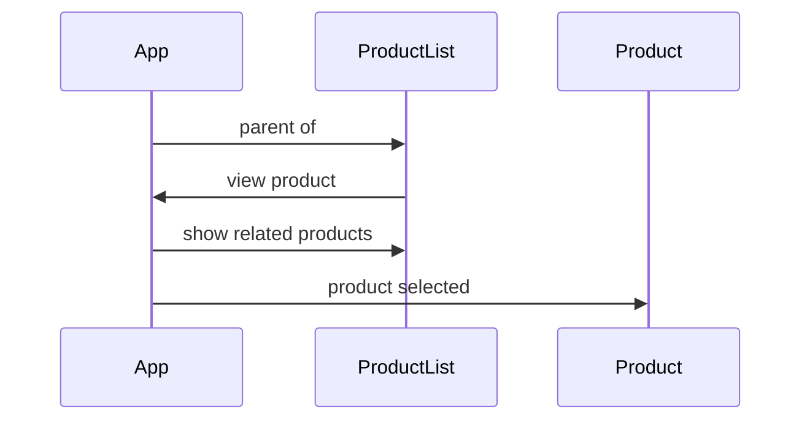
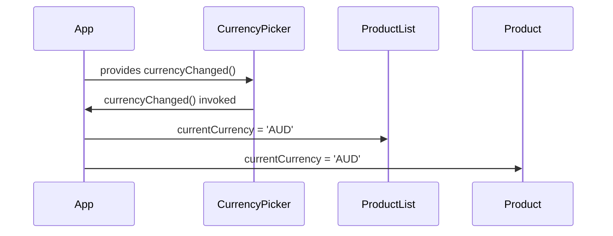

# Coding Challenge TL;DR
As per the brief, this application allows the user from 'XYZ Clothing' to view, edit and create products. Creating products wasn't explicitly mentioned but I added it in anyway because I wanted at least to have "CRU" out of "CRUD"; you can't delete anything. 
All the requirements listed in the 'MVP' and 'Bonus Points' have been reached.
`npm install` followed by `npm start` to get going.

## Overview

The app was built using the `create-react-app` NPM package as I wanted a quick way to get straight to programming. As I mentioned during the phone interview I had experience maintaining a react app but not building one from scratch.
I was going to add Redux at the end so I can appreciate/experience the process of adding it and have an understanding of application flow before and afterwards but I thought enough time had been spent.

There are four react components:

 - App 
 - CurrencyPicker 
 - ProductList
 - Product

`<App>` is the 'root' of the application (if you ignore the bootstrapping in `index.js`).
`<CurrencyPicker>` is a simple wrapper around a `<select>`
`<ProductList>` lists products but also renders a product if selected
`<Product>` shows product information, allows you to edit it and also displays a list of related products by using `<ProductList>`. 
When `<Product>` is in edit mode it renders a`<CurrencyPicker>` for selecting a currency but only the top level `<CurrencyPicker` has any cross-component state effects due to the callback, so it won't be mentioned during data flow discussion.
```
<App>
	<CurrencyPicker/>
	<Product/>
	<ProductList/>
```

##### Product Selection Flow


At any time the user can click 'View All' which will clear `ProductList`'s selected product and re-render the table.


##### Currency Selection Flow


### Future Changes
Make use of `<React.context>` where I would put the 'services' that the components passing them via `React.props`.
Error handling
Unit tests

### End

The following instructions are from the "Create-React-App" readme.
Ensure to `npm install` first.

# Getting Started with Create React App

This project was bootstrapped with [Create React App](https://github.com/facebook/create-react-app).

## Available Scripts

In the project directory, you can run:

### `npm start`

Runs the app in the development mode.\
Open [http://localhost:3000](http://localhost:3000) to view it in the browser.

The page will reload if you make edits.\
You will also see any lint errors in the console.

### `npm test`

Launches the test runner in the interactive watch mode.\
See the section about [running tests](https://facebook.github.io/create-react-app/docs/running-tests) for more information.

### `npm run build`

Builds the app for production to the `build` folder.\
It correctly bundles React in production mode and optimizes the build for the best performance.

The build is minified and the filenames include the hashes.\
Your app is ready to be deployed!

See the section about [deployment](https://facebook.github.io/create-react-app/docs/deployment) for more information.
